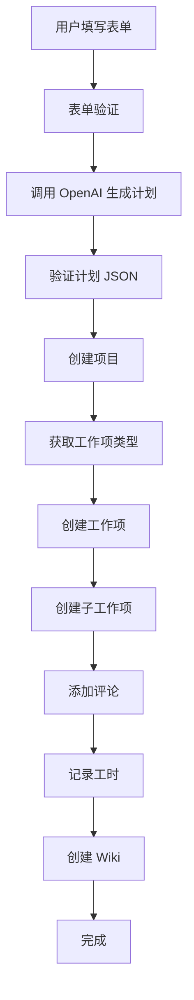

# ONES Demo 数据生成器

> AI 驱动的演示数据自动创建工具，基于 Next.js 14 + OpenAI + MCP 协议构建

## 🎯 项目概述

这是一个智能的演示数据生成器，能够根据用户输入的业务场景自动创建 ONES 项目管理系统的演示数据。系统使用 AI Agent 先生成结构化的数据计划，然后通过 MCP (Model Context Protocol) 协议调用 ONES 工具来创建实际的项目数据。

## ✨ 核心功能

### 📋 智能表单收集
- **公司信息**: 公司名称输入
- **项目管理模型**: 敏捷研发 / 瀑布研发 / 混合研发
- **演示需求**: 路线图管理 / 需求管理 / 缺陷管理（可多选）
- **业务形态**: 智能芯片制造、整车研发、软件外包、SaaS 等

### 🤖 AI 计划生成
- 使用 GPT-5（回退到 gpt-4o-mini）生成结构化演示数据计划
- 根据业务形态调整术语和描述风格
- 严格的 JSON Schema 验证确保数据质量
- 自动重试机制处理生成失败

### 🔧 MCP 工具调用
支持以下 ONES MCP Server 工具：
- `create_new_project` - 创建项目
- `get_list_of_issue_types` - 获取工作项类型
- `create_new_issue` - 创建工作项（支持父子关系）
- `post_issue_comment` - 添加评论
- `add_workhour_in_simple_mode` - 记录工时
- `create_page` - 创建 Wiki 页面
- `execute_issue_workflow` - 执行工作流

### 📊 实时监控
- **流式日志**: SSE 实时显示每个步骤的执行情况
- **进度跟踪**: 显示工具名称、参数摘要、执行时间
- **错误处理**: 失败步骤支持单独重试
- **结果展示**: 分类显示创建的项目、工作项、评论等

## 🏗️ 技术架构

### 前端技术栈
- **Next.js 14** - App Router + TypeScript
- **React 18** - 用户界面
- **Tailwind CSS** - 样式框架
- **shadcn/ui** - UI 组件库（Button, Card, Input, Select, Checkbox, Toast）
- **Lucide React** - 图标库
- **Zod** - 数据验证

### 后端技术栈
- **Next.js API Routes** - 服务端 API
- **Server-Sent Events (SSE)** - 流式日志传输
- **OpenAI SDK** - GPT 模型调用
- **自定义 MCP 客户端** - ONES 工具代理

### 核心模块
```
lib/
├── schema.ts          # Zod 验证 Schema
├── openai.ts         # OpenAI 客户端
├── mcp.ts            # MCP 客户端
├── logger.ts         # 流式日志工具
└── utils.ts          # 工具函数

components/
├── WizardForm.tsx    # 信息收集表单
├── StreamLog.tsx     # 实时日志组件
├── ResultPanel.tsx   # 结果展示面板
└── ui/              # shadcn/ui 组件

app/
├── page.tsx         # 主页面
├── settings/        # 设置页面
└── api/
    ├── generate/    # 生成 API (SSE)
    └── mcp/         # MCP 代理 API
```

## 🚀 快速开始

### 环境要求
- **Node.js**: >= 18.17.0
- **npm**: >= 8.0.0

### 安装依赖
```bash
npm install
```

### 环境配置
创建 `.env.local` 文件：
```env
# OpenAI API Configuration
OPENAI_API_KEY=your_openai_api_key_here

# ONES MCP Server Configuration
ONES_MCP_SERVER_URL=https://your-ones-mcp-server.com
ONES_MCP_SERVER_TOKEN=your_mcp_server_token_here
```

### 启动开发服务器
```bash
npm run dev
```

访问 http://localhost:3000 开始使用。

### 构建生产版本
```bash
npm run build
npm start
```

## 📖 使用指南

### 1. 配置 API 密钥
1. 访问 `/settings` 页面
2. 输入 OpenAI API Key
3. 配置 ONES MCP Server URL 和 Token
4. 点击"测试连接"验证配置
5. 保存配置

### 2. 生成演示数据
1. 在主页填写公司信息
2. 选择项目管理模型
3. 勾选需要的演示功能
4. 选择业务形态
5. 点击"开始生成 Demo"
6. 观察实时日志和创建结果

### 3. 查看结果
- 实时日志显示每个步骤的执行情况
- 结果面板按类型分组显示创建的项目数据
- 支持点击链接直接访问 ONES 系统中的对应项目

## 🔧 核心流程

### 数据生成流程


### AI 计划生成
AI 根据以下信息生成结构化计划：
- **公司名称** - 影响项目名称
- **项目管理模型** - 影响工作流程
- **演示需求** - 决定生成的数据类型
- **业务形态** - 调整术语和描述风格

生成的计划包含：
```typescript
{
  project: { name, description, roadmap? },
  issues: [{ title, type, description, assignees?, children? }],
  comments: [{ issueTitle, body }],
  worklogs: [{ issueTitle, hours, comment }],
  wikiPages: [{ title, content }]
}
```

## 🛡️ 错误处理

### 重试机制
- **网络错误**: 指数退避重试（最多 2 次）
- **API 调用失败**: 自动重试并记录错误
- **关键步骤失败**: 终止流程并提供清晰错误信息
- **非关键步骤失败**: 继续执行并标记警告

### 错误类型
- **配置错误**: API Key 未设置、MCP 服务器连接失败
- **验证错误**: 表单数据不完整、JSON Schema 验证失败
- **业务错误**: 工作项类型不存在、权限不足
- **网络错误**: 超时、连接中断

## 🔒 安全考虑

### 数据保护
- API Key 仅在服务端内存中临时存储
- 敏感数据在日志中自动脱敏
- 所有网络请求使用 HTTPS

### 访问控制
- 支持 MCP Server Token 身份验证
- 前端不直接存储敏感信息
- 演示环境建议使用受限权限账户

## 📋 验收标准

✅ **已完成的功能**
- [x] 表单验证：必填项校验和内联错误提示
- [x] AI 计划生成：3 秒内显示首条日志
- [x] 数据创建：支持项目、工作项、评论、工时、Wiki
- [x] 流式日志：显示工具名、参数、耗时
- [x] 错误处理：清晰的错误信息和重试选项
- [x] 设置页面：API Key 配置和连接测试

## 🤝 贡献指南

### 开发环境
1. Fork 项目
2. 创建功能分支
3. 提交更改
4. 创建 Pull Request

### 代码规范
- 使用 TypeScript 严格模式
- 遵循 ESLint 配置
- 组件使用 React Hooks
- API 路由使用 Next.js App Router

## 📖 开发文档

### ONES MCP 客户端开发文档

如果您想要在代码中集成 ONES MCP，请查看详细的开发文档：

📘 **[ONES MCP 客户端开发指南](./ONES_MCP_CLIENT_DEV_GUIDE.md)**

该文档包含：
- 🔌 连接 ONES MCP Server 的详细步骤
- 🔐 OAuth 2.0 授权机制完整流程
- 🛠️ 所有可用工具的调用示例
- 💡 最佳实践和注意事项
- 🐛 常见问题和故障排除

## 📄 许可证

MIT License

## 🆘 故障排除

### 常见问题

**Q: Node.js 版本不兼容**
A: 请升级到 Node.js >= 18.17.0

**Q: OpenAI API 调用失败**
A: 检查 API Key 是否正确，账户是否有足够余额

**Q: MCP 服务器连接失败**
A: 确认服务器 URL 和 Token 配置正确，网络连通性良好

**Q: 工作项创建失败**
A: 检查 ONES 项目权限，确认工作项类型存在

### 调试建议
1. 查看浏览器开发者工具的 Network 和 Console 面板
2. 检查服务端日志输出
3. 使用"测试连接"功能验证 MCP 服务器状态
4. 确认 .env 文件配置正确

---

💡 **提示**: 这是一个演示项目，展示了 AI Agent + MCP 协议的强大组合。在生产环境中使用时，请确保充分的安全测试和权限控制。